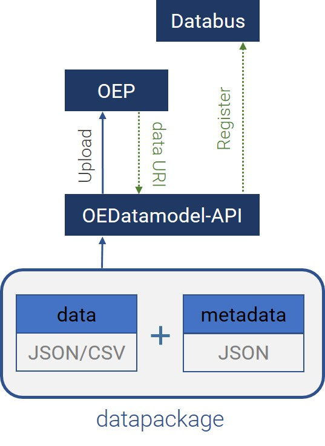

# SEDOS Documentation

Welcome to the documentation of the SEDOS project!

The documentation gives an overview of the tools in SEDOS, as well as important conventions for their usage.
In the project, we aim to establish a streamlined data management process with as much automation as practical.

The documentation is structured in two main parts 

1. [SEDOS-specific data requirements](./data_requirements/input_data.md) 
2. [Instructions on how to contribute data](./data_requirements/overview.md)

## Data architecture

This section provides an introductory overview of SEDOS' data architecture and its elements, which you will find explained more detailed in further parts of the documentation.

In the SEDOS project data is collected, preprocessed and published by work packages (WPs) 4 to 8. 
Therefore partners working in WPs 4-8 create multiple input data datapackages and upload them to the OEP.   
A datapackage consists of:

* **data** - containing parameters and values for modelling, 
* **datapackage** - describing the structure of the datamodel, and 
* **metadata** - providing context to the data. 

A generalized representation of a datapackage is shown in the figure below. 

These input datapackages will be automatically checked for updates and processed to one scenario bundle by the SEDOS Data Pipeline. The scenario bundle will also be published on the OEP. 
The partners in WP9 will download the scenario bundle from the OEP and use it to set up, parameterize and solve their energy system model. The modelling results will be postprocessed and uploaded to the OEP by the partners of WP9.

By applying the architecture above, we follow the [frictionless data](https://specs.frictionlessdata.io/data-package/) conventions.

# Summary of SEDOS conventions

In SEDOS data conventions are defined to ensure a seamless working experience.

1. [Data structure](data_requirements/input_data.md#Data-structure)
2. [Table naming](data_requirements/input_data.md#Table-naming)
3. [Mandatory metadata information](data_requirements/metadata.md#Mandatory-set-of-metadata-information)
4. [Annotation conventions for automatic data processing](data_requirements/ontology#Annotation-conventions-for-automatic-data-processing)
