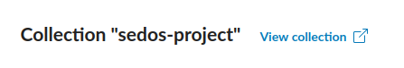
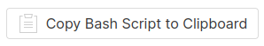
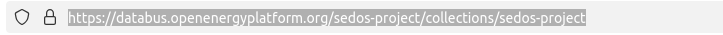

# How to download data?

You can have a look at the reference datasets and all related files on the [SEDOS Dashboard](https://sedos.apps.rl-institut.de/energysystem/artifacts/?collection=sedos-project&structure=SEDOS-structure-all).
On this page you can explore the different files of the dataset and have a look at underlying data.
In order to download the dataset to your local computer you need the so-called "collection". 
The collection on the databus can be visited by clicking on the external link "View collection":



We propose three different methods to download the dataset:

1. Via **bash script** (works on Linux, Windows support not tested):

    In the data section of the collection view on the databus you can find a button which copies bash instructions to clipboard.

    

    On your local maschine you can create a new folder and store instructions into a script file within the folder.
    Afterwards, you can run the script which will download all files of the dataset (collection) into current folder.

2. Via **python**:
    
    In order to download a dataset via python, you must first set up a python environment and install the required "data_adapter" package from the SEDOS repository:
    ```shell
    # Setup virtual python environment
    python -m venv .venv
    # Activate environment
    source .venv/bin/activate
    # Install data_adapter package
    pip install git+https://github.com/sedos-project/data_adapter.git 
    ```
    Afterwards, you can download a collection from databus by running `data_adapter` in the command line.
    You will need the URL of the collection which you can view at collection page on databus:
    

    This will download related files into current working directory.

3. By downloading the files **manually**:

    On the databus you can find related file URLs  in section "DOWNLOAD URLS". 
    From there, you can select file paths individually and open the path in your browser.
    This will download the selected file.