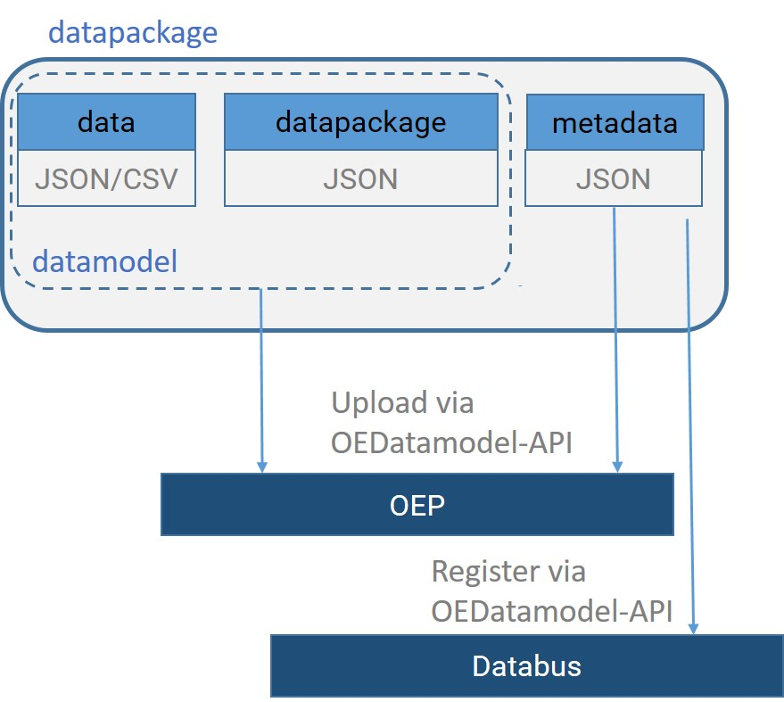

# Overview of the SEDOS data

## Sectors

The SEDOS Reference Dataset (SRD) entails technology data across five sectors (power, heat, x2x, industry, mobility) 
and various aggregation levels. The sectors and the used abbreviations within the data are listed below:

| Sector abbreviation | Sector     | SEDOS workpackage |
|---------------------|------------|-------------------|
| pow                 | Power      | AP4               |
| hea                 | Heat       | AP6               |
| x2x                 | Power to X | AP5               |
| ind                 | Industry   | AP7               |
| tra                 | Transport  | AP8               |

[//]: # (## TODO: Umfang der Daten beschreiben)

## Data Architecture

Multiple input data packages are created and uploaded onthe [OEP](https://openenergy-platform.
org/dataedit/view/model_draft?query=sedos&tags=246) via the [OEDatamodel-API](https://modex.rl-institut.de/create_table/).

The project's data architecture follows the [frictionless data](https://specs.frictionlessdata.io/data-package/) 
conventions. A generalized representation of a datapackage is shown in the figure below. A datapackage consists of:

* **data** - containing parameters and values for modelling, and
* **metadata** - describing the structure of the datamodel, and providing context to the data. 

