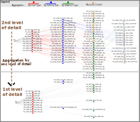

# Aggregations

## Selection and visualization of aggregations

- The aggregation mapping list clearly defines the composition of the aggregation levels.
- Modellers can take the relevant aggregations from the sectors from the reference data set.
- Modellers can carry out possible further aggregations themselves based on the level of detail and assistance (documentation).
- A tree structure can be used to display the aggregations graphically.

[//]: # (## FAQs)

[//]: # ()
[//]: # (What applies if aggregated processes have different &#40;non-fuel-related&#41; variable costs?)

[//]: # (- Aggregations must take place so you accept an error.)

[//]: # (- Sector APs decide which aggregation methodology makes the slightest error.)

[//]: # ()
[//]: # (Which input is used for the aggregated process? Can aggregation only take place within a fuel?)

[//]: # ()
[//]: # (- No - multiple inputs are enabled via "multiple input/outputs functionality")