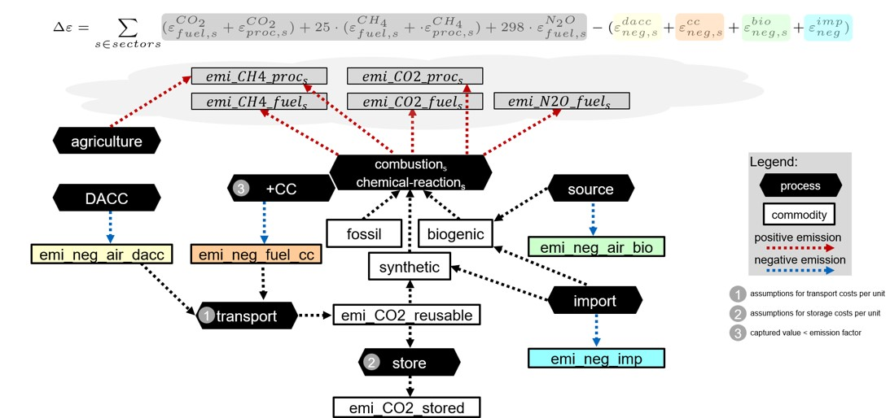

# Emissions concept

General information:

- Emission types considered: CO2, methane (CH4), and nitrous oxide (N2O), based on data from Germany's National Inventory Report.
- Global warming potentials (GWP) over a 100-year time horizon, relative to CO2, are adopted from the IPCC Fifth Assessment Report (AR5): CH4: 28, N2O: 265.
- Energy sources are categorized as fossil, synthetic, or biogenic, with the assumption that only carbon-capture-based synthetic imports are considered.
- No positive balancing is applied to electricity imports, constrained by country-specific limitations.
- Negative offsets are applied to imported biogenic and synthetically produced energy sources that carry CO2.
- Negative offsets also account for the growth of biogenic resources within Germany and for processes involving carbon capture (CC) or direct air carbon capture (DACC).
- Sector-specific emission targets are not defined, due to sector coupling and the multiple potential conversions of energy sources before final consumption.
- Exogenous demand and carbon-carrying by-products are allowed, with limited CO2 sinks; the system boundary is set at the product demand level.
- Emissions are differentiated globally (CO2): a foreign key links to the global table of emission factors per energy source.
- Sector- and process-specific emission factors are used for CH4 and N2O, as they are more dependent on specific process conditions (e.g., firing temperature for N2O, material moisture for CH4).
- Negative emissions are implemented within the model structure
- The emission variables as indicated in the  depict the flow sums over all considered timesteps (not the remaining commodities at the last timestep).

[//]: # (pip install python-markdown-math==0.2)
[//]: # (add markdown.extensions.math in yml extensions)

[//]: # ($$\Delta \epsilon = \sum_{s \in \mathrm{sectors}})

[//]: # (  \epsilon_{fuel,s}^{CO_{2}})

[//]: # (+ \epsilon_{process,s}^{CO})

[//]: # (+ 2\,\Delta N_{s}^{CH_{4}}\,\epsilon_{fuel,s}^{CH_{4}})

[//]: # (+ 2\,\Delta N_{s}^{CH_{4}}\,\epsilon_{process,s}^{CH_{4}})

[//]: # (+ 2\,\Delta S_{s}^{N_{2}O}\,\epsilon_{fuel,s}^{N_{2}O})

[//]: # (\;-\;)

[//]: # (\epsilon_{\mathrm{neg},s}^{\mathrm{doc}})

[//]: # (+ \epsilon_{\mathrm{neg},s}^{\mathrm{ac}})

[//]: # (+ \epsilon_{\mathrm{neg},s}^{\mathrm{bio}})

[//]: # (+ \epsilon_{\mathrm{neg},s}^{\mathrm{lump}}$$)

The following graphic visualizes the SEDOS emission concept:

Summarized, this means:

  - Fossil: CO2 emissions from combustion
  - Biogen: CO2 emissions from combustion & negative emissions from production/source processes of biogenic energy sources.
  - Synthetic: CO2 emissions from combustion & model-endogenous negative emissions for import and production with carbon captured CO2.