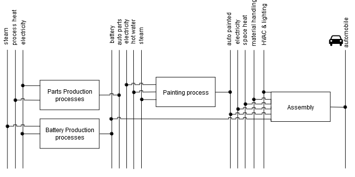
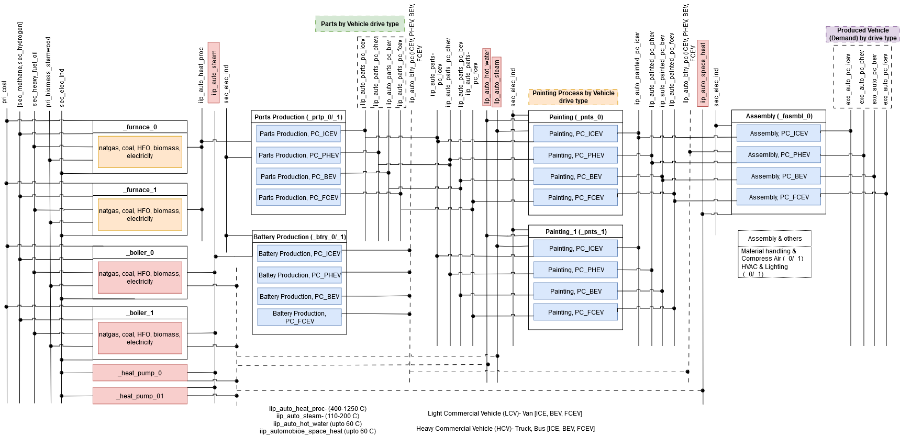
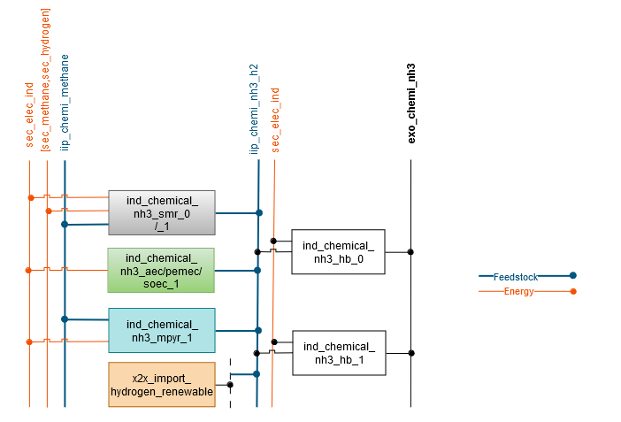
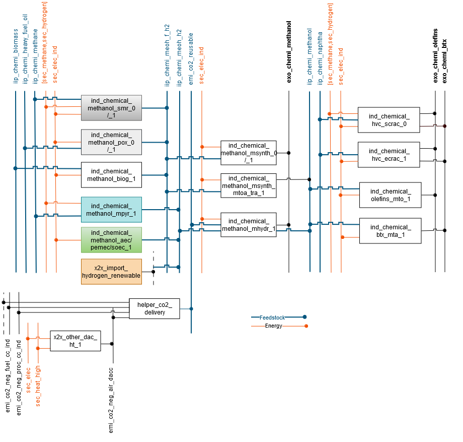

# Industry

## Naming convention
The industry dataset in SEDOS is categorized into sub-sectors of industry, which are aluminum, automobile, cement, copper, chemical, glass, paper, steel, and the rest of the industry (*ind_others_*). Moreover, industry also includes so-called 'autoproducer' processes (*ind_autoproducer_*) as self-generation technologies and two simplified agricultural processes (*ind_agri_standard_0*, *ind-agri_improved_1*) to account for emissions from livestock harvesting. The complex heterogeneity of industry sectors is represented by individual sub-sector process chains. Each sub-sector contains a bunch of processes within the process chains to capture the best possible energy consumption characteristics of the respective sub-sector, and the processes are driven by the exogenous demand of production (*exo_commodity*).  Furthermore, source processes (*ind_source_*) are also introduced where necessary to supply commodities (*e.g. raw materials, scraps*) the beginning of the process chain. 
The table below shows the nomenclature of process naming in industry.   
*Table 1: Nomenclature for the industry sector process naming.*

| Sector | sub-sector      | Process type/specification                                                                                | Stock/Expansion |
|--------|-----------------|-----------------------------------------------------------------------------------------------------------|-----------------|
| ind    | aluminum        | [pri, sec, aluminabayer]                                                                                  | 0               | 
|        | automobile      | [pc, hcv, lcv] [icev, phev, bev, fcev], prtp, bdys, pnts, hvlt, mcmp,fasmbl                               | 1               |
|        | cement          | [rk, rawmats, novel, finish, novelfinish],ccs                                                             |                 |
|        | copper          | [pri, sec]                                                                                                |                 |
|        | chemical        | [nh3, methanol, cl2, olefins, btx], hb, [msyn, mhydr], [memb, diaph], [scrac, ecrac, mto, mta], [smr, aec, pemec, biog, mpyr]                                                                                                                                  |                 |
|        | glass           | [flat, cont, spec, fibe], [batchplant, oxyf, oxyh, fulle, rege, recu, forming]                            |                 |
|        | paper           | [hchem, lchem, lmech]                                                                                     |                 |
|        | steel           | [blafu, elefu, dirred, hyddri, oxyfu, pellet, sinter, sponge, casting]                                    |                 |
|        | others          | [heat_pump, mdrive, heat_proc, steam, cool, kiln, light, pump_fans, solar_heat, ind_boiler, ict]          |                 |
|        |                 | autoproducer                                                                                              |                 |

## Provided parameters
Generally defined parameters are used in industry to provide the data. More details on parameters can be found in the relevant section of the documentation. In industry, only demand time series data are provided in a simplified manner. In SEDOS, no variation of production quantity is considered depending on temporal data. The demand profile is simply a normalized fraction of 1, which is calculated by dividing 1 by 8760 for the value of an hourly timeslice.

## General modeling approach
The industry sector has been classified into 12 major branches, with detailed modeling applied to eight of them, including automotive, cement, chemicals, glass and ceramics, iron and steel, non-ferrous metals, and paper. The remaining four branches food and tobacco, rubber and plastic, metalworking, and machinery equipment are included in the model structure in a simplified manner.
Figure 1 depicts a comprehensive overview of the representation of the industrial sector,including the 11 branches, their main exogenous demand products,and the considered existing and relevant novel production routes for each of those demands. The inclusion of self-generation technologies, particularly for electricity, is a key component of the industry model structure. This model differentiates between externally supplied electricity and self-generation within the industry, providing insight into energy generation-related investments and potential grid infrastructure needs. Self-generation technologies are used across the entire industrial sector, with no regard for industry branch specificity.

![Figure 1: Categorization of the industry subsectors (dark gray), its products (light gray) and the possible production routes (blue). *are modeled in an aggregated manner. **Food and tobacco, rubber and plastic, metalworking and machinery equipment industries are modeled individually yet in a simplified manner.Abbreviations: LCV: Light Commercial Vehicle; HCV: Heavy Commercial Vehicle; ICEV: Internal Combustion Engine Vehicle; PHEV: Plug-in Hybrid Electric Vehicle; BEV: Battery Electric Vehicle; FCEV: Fuel Cell Electric Vehicle.](../../graphics/industry_overview.png)
*Figure 1: Categorization of the industry subsectors (dark gray), its products (light gray) and the possible production routes (blue). *are modeled in an aggregated manner. **Food and tobacco, rubber and plastic, metalworking and machinery equipment industries are modeled individually yet in a simplified manner.Abbreviations: LCV: Light Commercial Vehicle; HCV: Heavy Commercial Vehicle; ICEV: Internal Combustion Engine Vehicle; PHEV: Plug-in Hybrid Electric Vehicle; BEV: Battery Electric Vehicle; FCEV: Fuel Cell Electric Vehicle. Source: Reveron Baecker, B. et al. (2024) "Comprehensive and open model structure for the design of future energy systems with sector coupling"*

### Automobile Industry
The automobile industry in SEDOS consists of energy consumption, techno-economic and emission data to produce automobiles in Germany. First, the types of automobiles are divided based on usage into passenger cars (*PC*), light commercial vehicles (*LCV*), and heavy commercial vehicles (*HCV*). Then these are also subdivided into based on drive types. So four different types of passenger cars are considered: internal combustion engine vehicles (*ICEV*), plug-in hybrid electric vehicles (*PHEV*), battery electric vehicles (*BEV*), and fuel cell electric vehicles (*FCEV*). Light commercial vehicles and heavy commercial vehicles are categorised into internal combustion engine vehicles (*ICEV*), battery electric vehicles (*BEV*), and fuel cell electric vehicles (*FCEV*). As per category of each automobile, production volume in million units is provided as an exogenous demand.   
The complex production process chains of the above-mentioned automobiles are portrayed through aggregated processes such as the parts production process, battery production, painting, and assembly in energy system model. The parts production process represents energy consumption data of most of the energy-intensive processes to produce components or parts of automobiles. Parts production processes hold aggregated energy consumption data for metal forming (stamping, extruding, casting, drawing, machining, forging), polymer forming (injection molding, compression molding, blow molding, extruding, calendering), glass and carbon fiber reinforced plastic fabrication, welding, and others. Electricity and process heat (400–1250 °C) as input commodities flow into the part production process. Different process heat technologies, such as furnaces based on energy carriers, are available to generate process heat for the parts production process. The battery production process includes energy consumption of drying, dry room, notching, stacking, final sealing, and other processes to produce the battery. Electricity and steam (110-200 °C) are input commodities for battery production. The energy consumption of pretreatment, painting, undersealing, cavity protection, drying, and other processes is depicted by the painting process, where electricity, hot water (up to 60 °C), and steam (110-200 °C) are input commodities for painting processes. Similar to technologies for process heat, techno-economic data for hot water and steam generation technologies are prepared and made available accordingly. Finally, the assembly process completes the chain by producing exogenous demand (*automobile*). The simplified process chain of automobile production processes is depicted in Figure 2.

*Figure 2: Simplified representation of Automobile industry process chain.*

Parts production, battery production, painting, and assembly processes are distinguished and prepared for each automobile type as categorized so that the energy consumption burden is specific to each automobile type. It is important because energy consumption varies depending on the automobile type, as the size, components, and materials of the automobile are different for individual automobile types. During the data preprocessing, these factors are considered, and data are processed accordingly. Which means required energy consumption in SEDOS data to produce parts for internal combustion passenger car (*ICEV*) is different than any other different automobile whether it is passenger car (*PHEV, BEV or FCEV*) or commercial automobile (*LCV or HCV*). This approach is also true for battery production, painting and assembly process so that energy requirements to produce automobile specific to each category. An overview of the passenger car production chain in modeling schema follows in figure 3, with distinguished production processes based on automobile type.

*Figure 3: Modeling schema of passenger car production chain.*

Input commodity flows into the processes are given in petajoules (*when a commodity is an energy carrier*) and in million units (*when a commodity is material, e.g., a battery or parts*) per million units of output. No emissions are assumed in these processes. 
Emission occurs in the processes that generate process heat, steam, hot water, and space heat, depending on the technology. Input flow for these heat generation technologies is given in petajoules (*PJ*) per PJ output. As an example, for a gas boiler whose efficiency is considered 85 percent, the input and output flow conversion factors are given as follows:

            input (1 PJ) -> boiler -> output (0.85 PJ) + emissions 
            sec_methane (1 PJ) -> boiler -> iip_auto_steam (0.85 PJ) + emi_co2_ind (55.8 Kt) + 
                                            emi_ch4_ind (0.002 Kt)  + emi_n2o_ind (00005 Kt)

Combustion emission coefficients are provided in terms of input flow and in thousand tonnes (*Kt*) per PJ. Base year processes with existing capacity and best available and innovative technologies as new invest processes are also introduced, where it is assumed that base year processes stock decreases linearly and new processes can take place with given investment cost. To summarize the modeling approach of the automobile industry process chain, process heat, steam, hot water, and space heat are produced by respective technologies. Then the parts production process produces parts (*e.g., iip_auto_parts_bev*) for a specific automobile by consuming energy (*iip_auto_heat_proc and sec_elec_ind*), then the parts (*e.g., iip_auto_parts_bev*) go into the painting process alongside energy carriers (iip_auto_hot_water, iip_auto steam, and sec_elec_ind) and produce painted commodities for the specific automobile (*e.g., iip_auto_painted_bev*). The battery production process for the specific automobile produces batteries as an output with the input flow of steam and electricity (*iip_auto_steam and sec_elec_ind*). At the end of the process chain, painted automobile commodities(*e.g., iip_auto_painted_bev*), batteries for the specific automobile (*e.g., iip_auto_btry_pc_bev*), energy carriers(*iip_auto_space_heat and sec_elec_ind*), and other commodities such as material handling and compressed air(*iip_auto_mcmp*) as well as HVAC and lighting (*iip_auto_hvlt*) are taken as input in the assembly process,and final exogenous demand is produced as output (*e.g. exo_auto_pc_bev*).
 
### Cement Industry
### Chemical Industry
The chemical industry in SEDOS covers the data set of chemical industry production in Germany to be utilized in an energy system model.  Hundreds of different chemical processes are in operation to produce thousands of different chemicals, which means the production path of the chemical industry is complex.  The data set and the modeling approach of the chemical industry can be differentiated in terms of the exogenous demand of the chemical industry. The basic chemicals- chlorine, ammonia, methanol, olefins (*ethylene, propylene, butadiene*), and aromatics (*benzene, toluene, xylene*) make up the largest share of the chemical industry. The exogenous demand for these basic chemicals is given in million tons (*Mt*), so the energy consumption and techno-economic data are directly related to the production volume of these basic chemicals. Then, the rest of the chemical industry demand is represented by the energy service demand, which is given in Petajoule (*PJ*). 
The chemical industry heavily relies on fossils, both for energy and feedstock, aka non-energetic consumption.  In SEDOS chemical industry data, the flow of energy and feedstock into processes to produce chemicals is distinguished, where it is significant. That means feedstock flows separately integrated not only for carbon-contained fossil feedstocks (*e.g. natural gas, naphtha, heavy fuel oil, etc*) but also alternative low-carbon or green feedstocks (*e.g. hydrogen from electrolysis, green methanol*). On the other hand, feedstock flow for chlorine production, nitrogen as feedstock in the Haber-Bosch process, or water in the electrolysis process are not included in this work. The emission from fuel combustion and the emission from feedstocks or process-related emissions are categorized as combustion and process emissions, respectively. The combustion emission is usually input-specific and process emission is related to output. Techno-economic data are provided for conventional technologies, best available technologies (*BAT*), and innovative technologies accordingly. Use of captured Carbon-di-oxide (*CO2*) as feedstock is also enabled with carbon-capture technologies, and those captured CO2 are made available to be utilized as feedstock through the delivery process (*helper_co2_delivery*). 
Relevant technologies are provided to produce hydrogen, which will be used as feedstock in the chemical industry to produce ammonia and methanol. The hydrogen production technologies and hydrogen commodities names are created accordingly, considering hydrogen as input flow into the methanol synthesis process and Haber Bosch process, respectively. The ammonia production modeling schema is presented in Figure 4. 

*Figure 4: Modeling approach of ammonia production process chain.*

Hydrogen commodities for methanol production are specified variably, whether the hydrogen (iip_chemi_meoh_f_h2) is generated from fossil feedstock (*natural gas, heavy fuel oil*) or biomass or the hydrogen (*iip_chemi_meoh_h2*) is green hydrogen. Two different methanol commodities are introduced, one (*exo_chemi_methanol*) represents exogenous methanol demand and another (*iip_chemi_methanol*) can be used further in the chemical industry as feedstock into methanol-to-olefins or methanol-2-aromatics processes. High-value chemical production processes are differentiated to satisfy the exogenous demand for aromatics and olefins. Figure 5 shows the modeling approach of exogenous demand for methanol and methanol flow as feedstock for high-value chemicals production, including a simplified feedstock flow of CO2. 

*Figure 5: Modeling approach of methanol and high value chemicals production process chain.*

The production volume of ethylene is considered to represent the exogenous olefins demand due to the coupled production of conventional process (*steam cracking*).  Processes and energy service commodities- steam (*iip_chemi_steam*), process heat(*iip_chemi_process_heat*), other processes(*iip_chemi_processes_others*), electro-chemicals (*iip_chemi_electro_chem*) and machine drive (iip_chemi_machine_drive)  are introduced accordingly to meet the exogenous energy service demand (*exo_chemi_others*) of rest of the chemical industry. 

### Glass and Ceramics Industry
### Iron and Steel Industry
### Non-ferrous metals Industry
### Paper Industry
### Rest of the Industry
The Rest of the Industry in SEDOS consists of the following industrial branches, as also depicted in the energy balance for Germany:

- Food and Tobacco
- Rubber and Plastics
- Metal processing
- Machine manufacturing
- Other manufacturing

The processes in these industry branches contain detailed information on energy consumption, techno-economic and emission data for the relevant steps in the production of goods. The demand is expressed in Petajoules (*PJ*) and represents the energy service that amounts to the production within these branches. 

The Rest of the Industry is modeled using 57 distinct processes, each depicting specific energy applications: machine drives, lighting, information and communication technology (*ICT*), process heat and process cooling. The total useful energy required for each energy application flows in the demand processes. For process heating a variety of technologies are used, including boilers, kilns, heat pumps, solar heat and heat exchangers. These technologies generate steam, high temperature heat or directly process heat. Heat exchangers are used to transform district heat into process heat.

### Self-generation

The  Self-generation or autoproducer can be distinguished by the sector they are used in and the energy type they are using. They are also split up into already existing autoproducers and autoproducers that will be created in the future. The future technologies are only categorized by the fuel type. Because they can be used in every industry sector, there would be too many individual processes if the were all individual for each sector. 
The existing autoproducers are used in five different sectors. In the steel, chemical, food and tobacco, aluminium and paper industry. In the steel industry only cokeovengas is used as an energy carrier. In the chemical industry coal, methane and heavy fuel oil is used.In the food and tobacco industry coal and methane is used. In the aluminium industry only methane is used. In the paper industry coal, methane, stem wood, black liquor, heavy fuel oil and naphtha autoproducers exist. For future autoproducer, the energy carriers are methane, biomass pellets, stem wood, hydrogen, coal, bio and non bio waste, biogas, oil, sewage sludge and black liquor. There are aggregated autoproducers in the model structure as well. These aggregated processes are categorized by their energy carrier. For the existing autoproducers there are for coal ,methane and heavy fuel oil processes combined. In the future autoproducer processes we have small and large coal and small, medium and large methane autoproducers. Those are aggregated to two processes.

## Time series provided