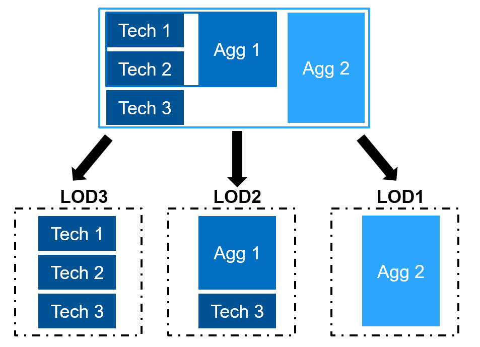

# Levels of Detail (LODs)
!!! note ""
    In the SEDOS approach the sectors have a high flexibility in defining and applying aggregation levels to their model structure. 
    This means different sectors can customize how they group or detail the information according to their needs.
    The concept of Levels of Detail (LODs) with aggregation levels, as depicted in the diagram below, 
    illustrates a structured approach to managing a model structure with different levels of detail without redundancy.

## Design Principles

- Flexible Aggregation: Not every aggregation level needs to include all technologies. This flexibility allows specific levels to focus on the most relevant technologies, 
making it easier to streamline information and avoid unnecessary complexity.
- Building upon Each Other: Aggregation levels can layer on top of one another. Lower levels (like LOD3) provide more granular details, while higher levels (like LOD1) present more aggregated information. 
This layered approach ensures that different users or stakeholders can access information at varying degrees of complexity, based on their needs.

## Examplary LOD structure:

- LOD3 (Most Detailed): This level includes individual technologies (Tech 1, Tech 2, Tech 3) in full detail. It represents the most granular level, where each technology is presented independently.
- LOD2 (Intermediate Detail): This level begins to aggregate some elements, combining "Tech 3" with "Agg 1" (an aggregated grouping of technologies). LOD2 provides an intermediate level of detail, balancing specificity with some aggregation.
- LOD1 (Least Detailed): The highest level of aggregation, LOD1, takes the highest possible grouping of technologies. This level provides the most summarized view, ideal for high-level analysis or reporting.

