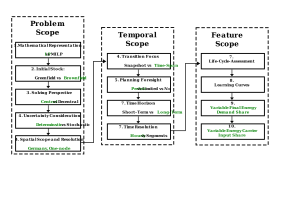

# Model Base

As a result of thorough discussions in the 3rd working package of the SEDOS project, the following list
provides assumptions and requirements to understand the model base. 
This sets the basic framework for modeling with the provided model structure with different model generators.
The key points of the model base are:

- Deterministic model formulation with a Linear Programming Optimization.
- Intertemporal Time-Span modeling with perfect foresight. Capacity expansion limits have been defined per milestone years.
- Central planner solving perspective for macro-economic optimization. Business/regulatory aspects are neglected as far as possible.
  A consistent Weighted Average Cost of Capital (WACC) of 2% has been defined for all technologies and if necessary, taxes are deducted from the prices.
- Brownfield approach: Differentiation between existing technology stock (0X) vs new technology expansion (1X).
- Long-Term time horizon until 2070.
- Hourly time resolution.
- The time horizon can optionally be reduced with type weeks, e.g. by applying the time series aggregation [tsam](https://tsam.readthedocs.io/en/latest/index.html) tool.
- The SEDOS data are provided for a 1-region Germany model. Infrastructure costs are estimated for the delivery of relevant commodities.
- A distinction is made between five [commodity categories](../data/nomenclature.md#commodity-nomenclature): primary energy (pri), secondary energy (sec), industrial intermediate products (iip), emissions (emi) and model exogenous energy demand (exo). 
- The exogenous demand in the model is defined in such a way that the model has maximum degrees of freedom to choose between 
the technologies to meet the demand. The final energy demand in the system is thus determined endogenously.
- For the processes, a distinction is made between complementary inputs/outputs with a fixed ratio to each other and 
substitutive inputs/outputs with a flexible ratio. This also allows to model processes that can choose their energy sources endogenously.
- To ease the feasibility of SEDOS-based models, additional [aggregation levels](aggregations.md) are introduced due to the high level of 
  detail in the sectors. This allows the user to configure their desired [levels of detail](lods.md) while focusing on chosen sectors while other sectors can be considered in a simplified version.
- The European electricity market is considered but modeled in a simplified manner.

 
The central assumptions are additionally highlighted in the figure below:
 

