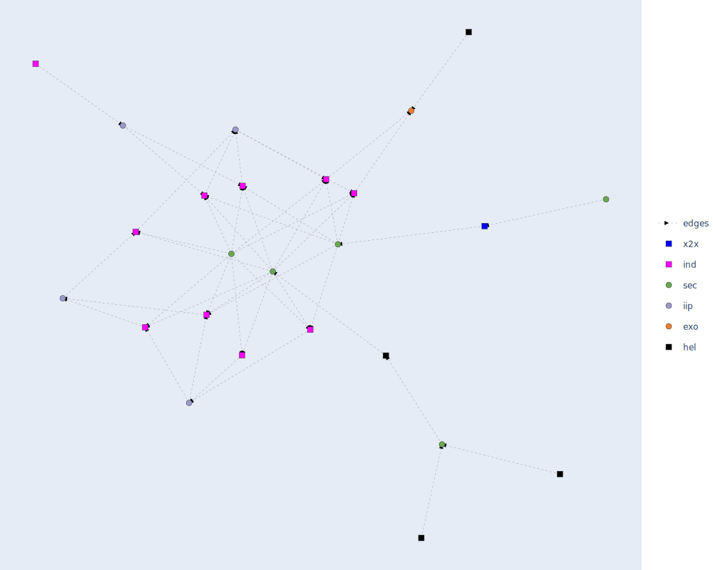
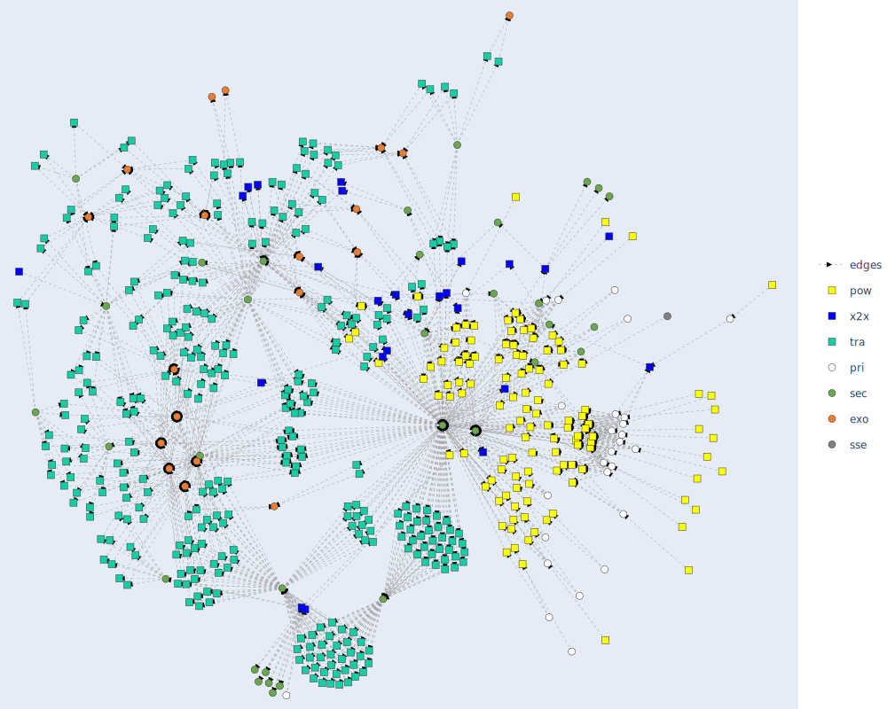

# Exemplary network graphs
The network graph is designed to be flexible, allowing for the visualization of model structures across different sectors and their interconnections.
The figures below illustrate the network graph representation of the SEDOS model structure for 3 different case studies applied within our model frameworks.
In the related section of the [GUI](https://sedos.apps.rl-institut.de/) at the "Generate Networks" button the graphs are interactive, 
enabling users to zoom, hover for node names, and explore the model structure in greater detail. 
Users can customize their view by adjusting sectors, mapping algorithms, or by focusing on specific processes or commodities.

**Oemof model with focus on the steel industry sector**
{width=800px}

**FINE model with focus on the transport sector and its supply processes**
{width=800px}

**TIMES model with all sectors and their intercorrelations**
{width=800px}