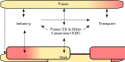

# Overview

## Alignment
The SEDOS focus is on understanding...

- The overall system,
- The technical foundation in the sectors,
- The possible relations and interactions due to sector coupling.

The model structure is used to build up energy models in three different frameworks: oemof, FINE and TIMES.
Key components of the model structure are defined in this Section. For further information please consult the open-access [publication](TODO:Link).

The different sectors and their general interfaces are shown in the figure below:

