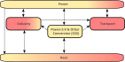

# Overview

The SEDOS focus is on understanding...

- ...the overall system,
- ...the technical foundation in the sectors,
- ...and the possible relations and interactions due to sector coupling.

The model structure is used to build up energy models in three different frameworks: oemof, FINE and TIMES.
Key components of the model structure are defined in this Section. 
The related model-structure is available at [Zenodo](https://doi.org/10.5281/zenodo.17105060).  
For further information please consult the open-access [publication](https://doi.org/10.1016/j.rset.2024.100094).

The different sectors and their general interfaces are shown in the figure below:

{width=800px}