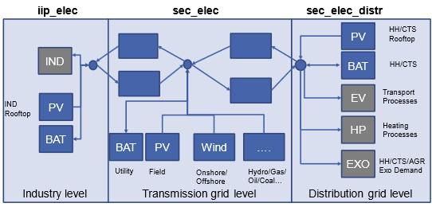

# Power sector

## Naming convention

The power sector in the SEDOS dataset is dominated by power generation processes
which are mainly classified based on the input commodity for the conversion
processes and the conversion type. Besides of combustion processes, which may
convert various energy carriers (fossil, biogene or synthetic) of different
states (solid, liquid or gaseous) into power and require an additional
specification of the main fuel type in the naming convention, the dataset is
mainly structured according to processes which are directly associated with a
primal energy carrier-based conversion, such as photovoltaics, wind turbines,
marine, geothermal and hydro, as well as nuclear power. Further, the dataset
includes power storage processes, sink and source processes and flow processes.
With a focus on modelling the German energy system within a the single-node
approach in SEDOS, a country prefix is added to all foreign power (pow)
processes for modelling the European power system. A two-digit country code is
added to non-German processes in case of a detailed modelling of the European
power sector on a country basis, while a single digit prefix is assigned to
country groups, aggregating multiple countries. Only for crossborder power
flows, which are modelled as conversion processes between country (or
country-group) specific electricity commodities, a prefix defining the from-to
power flow relation is added.

For power generation and storage processes, the naming further includes the
technology class and the conversion specification as well as the fuel type
class, in case of combustion processes. For combustion and geothermal processes,
the technology type differentiates between steam turbines (st), gas turbines
(gt), combines cycle (cc), organic rankine cycle (orc) and internal combustion
(ic) processes. Without further specification an electricity only conversion
process, which convert one or multiple fuels to electricity as well as process
and fuel related emissions, is assumed. For combined heat and power (chp)
processes, producing additionally heat or carbon capture and storage (ccs)
processes, which allow for a reduction of greenhouse gas emissions, a
specification is added to the naming. For combustion processes, finally the main
fuel type is added in the naming convention, allowing a differentiation between
primary hydrogen, methane, oil, coal, lignite, biomass, biogas, waste and
syngas fueled processes.

Concerning the modelling of renewable power generation processes a specification
of the location or the applying sector is added for a further differentiation of
the primary energy conversion processes. For wind-turbines this includes a
differentiation between onshore (on) and offshore (off) turbines with a further
differentiated between floating (fl) and fixed-bed (fb) installations in case of
offshore applications. PV is diffentiated in ground-mouted (gm) field (fiel) and
rooftop (roof) installations on buildings belonging to the household sector
(hh), commercial trande and sevices sector (cts) and industry sector (ind). An
analogous differentiation is made for battery (batt) storages, allowing a
differentiation between utility (util) application and hh, cts and ind
applications. Besides of battery storages, the class of electricity storage also
includes hydro storages, which are further differentiated in pure seasonal
storages without a pump process and pump-storages (ps). For pump-storages the
naming differentiation between open cycle processes, which include a natural
inflow and closed cycle processes, without a natural inflow.

For all processes a differentiation between existing installations (0) and
expansion options (1) is made. In order to allow a distinction of varying
resource classes (e.g., for intermittent renewables) or varying feedstocks
(e.g., for different biomass resources) the stock or expansion classification
might be further differentiated. This is done by an increasing counter at the
process ending, enumerating different existing ([01,..0XX]) or potential
[(11,..,1XX]) options.

### Table 1: Nomenclature for the power sector process naming

| Region | Sector | Mode/Process Type | Technology/Location | Specification | Fuel | Stock/Expansion |
|--------|--------|-------------------|---------------------|--------------|------|-----------------|
| [ ],[xx,yy],[a,b] | pow | combustion | gt, st, cc, ic | chp, ccs | methane, hydrogen, oil, coal, lignite, syngas, biomass, biogas, waste | 0, [01…0XX] |
|        |       | photovoltaic | fiel | gm |              | 1, [11---1XX] |
|        |       |                 |     | hh, cts, ind roof |  | |
|        |       | wind_turbine | on | | | |
|        |       |               | off | fl, fb | | |
|        |       | nuclear | fis, fus | | | |
|        |       | marine | | | | |
|        |       | geothermal | orc, st | chp, ccs | | |
|        |       | hydro | ror | | | |
|        |       | storage | batt | util, hh, ind, cts | | |
|        |       | hydro | seasonal, ps_ol, ps_cl | | | |
|        |       | source | | hydro_energy, hydro_nat_inflow_seasonal, hydro_nat_inflow_openloop, lignite, bioenergy, sewage, landfill, waste, cbm | | |
|        |       | sink | | exo_sec_elec | | |
|     [xx_yy],[a_b],[a_de]   |       | flow | | | |  |

## Provided parameters

The scalar parameters provided are described in Table 2.

| Parameter | Unit | Explanation |
|-----------|------|-------------|
| lifetime | a | Technical lifetime of a process. |
| potential_annual_max | GWh | Maximum annual energy use of a commodity. |
| demand_timeseries | - | normalized demand timeseries which gets multiplied with demand_annual |
| demand_annual | GWh | Projected annual demand for a commodity. |
| shared_potential_id | str | Specifies a name for a potential group in which all components share the same potential (e.g. wind turibine) |
| capacity_p_inst_0 | MW | Existing throughput power output capacity per process in a certain year. |
| capacity_p_min | MW | Minimum installable capacity per process. |
| capacity_p_max | MW | Maximum installable capacity per process. |
| capacity_e_inst_0 | MWh | Existing storage energy capacity. |
| capacity_e_min | MWh | Minimum required storage energy capacity. |
| capacity_e_max | MWh | Maximum allowed storage energy capacity. |
| capacity_p_abs_new_max | MW | Absolute upper bound on level of investment in new power output capacity for a period. |
| availability_timeseries_max | - | Time series of maximum capacity factor in relation to installed capacity. |
| cost_inv_p | EUR/MW | Investment costs for new throughput power output capacity. |
| cost_fix_p | - | Operation independent costs for existing and new throughput power output capacity. |
| cost_var_e | EUR/MWh | Variable costs per throughput energy unit output. (excluding fuel costs). |
| conversion_factor_<commodity> | MWh/MWh | Commodity-specific conversion factor (multiplication of input and output factors yields the efficiency of the process). |
| ef_<commodity>_<emission> | kg/MWh | Commodity-specific emission factor. |
| cb_coefficient | - | The Cb-coefficient (backpressure coefficient) is defined as the maximum power generation capacity in backpressure mode divided by the maximum heat production capacity (including flue gas condensation if applicable). |
| cv_coefficient | - | The Cv-value for an extraction steam turbine is defined as the loss of electricity production, when the heat production is increased one unit at constant fuel input. |
| efficiency_sto_in | percent | Energy efficiency of power input. |
| efficiency_sto_out | percent | Energy efficiency of power output. |
| sto_ep_ratio_binding | MWh/MW | Fixed ratio of the storage energy capacity to its power output capacity. |
| sto_io_ratio_binding | MW/MW | Fixed ratio of the storage power output capacity to its input capacity. |

All costs are presented excluding taxes and subsidies, based on 2021 price
levels.

## General modeling approach

The considered power generation processes are modelled as
multi-input/multi-output conversion processes which consume one or more input
commodities and produce on or more output commodities. In general, these
processes can be categorized into electricity only production (EOP) processes
and combined heat and power (CHP) processes. Depending on the fuel and/or
technology type, the conversion also leads to emissions, of which CO2, CH4 and
N20 are considered in the dataset. In case of a carbon capture and storage
specification (CCS) of a conversion process, a fraction of the emitted CO2
emissions is balanced as a negative emission commodity. Besides of power
generation processes, the dataset includes the parametrization of electricity
storage processes, electricity sink and source processes and processes for
modeling the electricity flow between different applications (sectors/ voltage
levels) and between different countries within a single-node approach. In this
context, electricity flows between countries and between different application
areas are modelled in a single node approach by defining additional conversion
processes that enable country-specific or application-specific flows of energy
carriers and emissions, as well as their conversion processes, to be balanced.
The conversion processes in the electricity sector are thus defined for each
country and application field (industrial process or non-industrial conversion
at distribution or transport network level) separately with the corresponding
specific input and output commodities. Conversion across national borders and
application levels is represented by auxiliary processes, which can be
parameterized with corresponding losses, expenses, inventory capacities, and
investment options

## Aggregation of the European power generation stock and expansion options

The aggregation of processes is technology- and country-specific. For wind and
PV technologies, existing profiles are consolidated into a single profile of the
remaining stock in each modelled year. This implicitly takes into account the
technology and regional distribution changes of the existing stock within a
country, resulting in varying profiles of the remaining stock in different model
periods. For expansion options, the potential generation is aggregated into nine
classes according to project status (repowering, planned, expected, greenfield)
and LCOE. It is assumed that a replacement investment (repowering) will take
place at the end of the technical service life, whereby the optimal wind turbine
will be placed on the existing site, taking into account distance restrictions
and shadowing effects (wind ellipse). Planned projects are based on literature
research (e.g., GEM). In order to better estimate future capacities and
profiles, the remaining potential on open land (greenfield), which is clustered
according to LCOE (levelized cost of electricity), is reduced by the expected
additional capacity according to a reference scenario. PV processes are
additionally differentiated according to sectoral application (e.g., residential
roofs, commercial roofs, open space) and building typology, while wind turbines
are only differentiated between onshore and offshore (floating or fixed-bed)
technologies. 

In the field of combustion technologies, the challenge lies in the meaningful
aggregation of the large number of existing plants. Here, processes are
classified according to fuel type, technology type, and other specifics (e.g.,
CHP, CCS). By differentiating according to technology class and the unique
combinations of input variables (fuels) and output variables (electricity,
heat, emissions, etc.), the tradeoff between accuracy and a reduced number of
processes is balanced as much as possible. Thus, the parameters correspond to a
capacity-weighted average, as plants of different types and ages are aggregated
within a country. This results in weighted averaged efficiencies of the
conventional generation stock of a country of the same technology and fuel
class. In consequence the merit order of existing powerplants is less accurate
and a clean modelling of between different CHP characteristics, such as a clean
differentiation between back-pressure and steam-extraction turbines, is not
possible, as back-pressure (cb) coefficients and power loss factors (cv) are
averaged. For expansion options of combustion technologies, potential local
characteristics, such as varying fuel cost or availability restrictions within a
country are ignored and power plant type specific investment options from the
literature are taken

## Modelling of power flows

Network restrictions are mapped in the simplified single-node approach by
assigning all power conversion processes to national nodes and application
fields. This allows energy flows between countries and between different levels
(e.g., industry, distribution network, transport network) to be mapped via
additional conversion processes. The TYNDP 2024 serves as the basis for
determining the existing transfer capacity and possible expansion options. Since
country-specific modeling of the electricity sector can be computationally
challenging depending on the application, SEDOS also offers the option of
aggregating national electricity conversion processes in Europe at the level of
country groups. This involves defining seven country groups, each of which is
linked to each other and to Germany via aggregated exchange processes and which
approximate the structure of the European foreign sector from Germany's
perspective: 
- **Aggregation option for countries:**   
  A (AT, CH, HR, IT, SI)  
  B (FR, ES, PT)  
  C (BE, LU, NL)  
  D (DK, EE, FI, LT, LV, NO, SE)  
  E (CZ, HU, PL, SK)  
  F (AL, BA, BG, GR, ME, MK, RO, RS)  
  G (UK, IE, CY, IS, MT)
  
The modelling of power flows between different levels of the network within a
country is illustrated in the following figure:

*Figure 1: Assignment of power generation and consumption processes to different
grid levels.* 

In this case, all large thermal power plants and all electricity generators and
consumers that are not explicitly assigned to a sector (industry, households,
commercial, transport, or heating) are assumed to be connected to the
transmission grid. On the other hand, there are industrial consumers and
industry owned generators, which produce and consume an industry specific
electricity commodity (iip_elec). Similarly, all decentralized consumers
(households, commercial, transport, heat), generators, and storage facilities
are modelled. This means that these processes convert a distribution network
specific electricity commodity (sec_elec_distr) which allows to represent the
feed-in or load on distribution grid level. By introducing auxiliary conversion
processes between the dedicated electricity commodity of industrial and
decentral processes and the general electricity commodity on transmission grid
level, a balancing of power flows within a country is possible.
