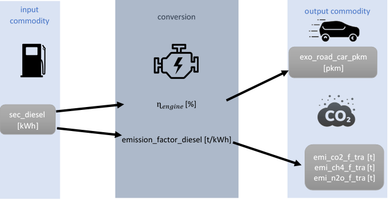
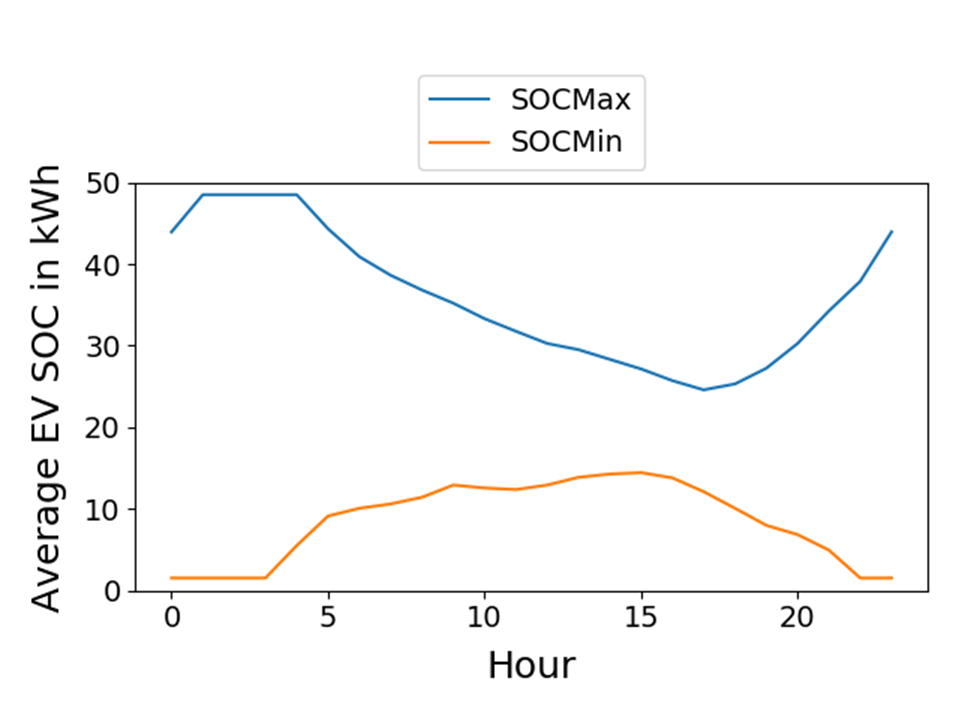

# Transport sector

## Naming convention
The transport sector in the SEDOS dataset is divided into road, water, air and rail modes. The road-based vehicles include light (*l*), medium (*m*) and heavy (*h*) cars and trucks as well as coaches (*long* distance) and buses (*short* distance), motorcycles and special vehicles in the agricultural (*agri*) and construction (*const*) industries. For waterway transport, the focus is on inland freight shipping. High seas bunkering is not included in the energy balance, because the fuel is consumed outside national borders in international waters, and it is therefore not considered part of domestic energy usage. In the field of aviation, a distinction is made between domestic flights (*natio*), European flights (*europ*) and intercontinental (*inter*) flights and passenger transportation alone is accounted for. Finally, a distinction is made between short-haul (streetcars, shunting operations) and long-haul (long-distance trains) for both passenger (*pass*) and freight (*frei*) rail transport. A suitable selection of drive technologies (internal combustion engine vehicle – *ice*, hybrids – *hyb*, fuel cell electric vehicle – *fcev*, battery electric multiple unit meaning a combination of batteries and overhead cables – *bemu*, battery electric vehicles – *bev* and overhead electric vehicles – *oev*) and fuels is combined for all vehicle types and organized as separate processes in the model structure. The nomenclature for process naming follows the system below, that is further explained in Table 1:
tra_rail_hyb_pass_short_hydrogen_0.

*Table 1: Nomenclature for the transport sector process naming.*

| Sector | Mode   | Type (including information on weight) | Drive Technology | Transported Unit | Specification | Fuel      | Stock/Expansion |
|--------|--------|----------------------------------------|------------------|------------------|---------------|-----------|-----------------|
| tra    | road   | car/lcar/mcar/hcar                    | ice              | pass             | long          | ammonia   | 0               |
|        | water  | truck/ltruck/mtruck/htruck            | hyb              | frei             | short         | gasoline  | 1               |
|        | air    | bus                                   | fcev             |                  | natio         | diesel    |                 |
|        | rail   | motorc                                | bemu             |                  | europe        | hydrogen  |                 |
|        |        | agri                                  | bev              |                  | inter         | methanol  |                 |
|        |        | const                                 | oev              |                  | wallbox       | ethanol   |                 |
|        |        |                                       |                  |                  | engine        | cng       |                 |
|        |        |                                       |                  |                  | battery       | lpg       |                 |
|        |        |                                       |                  |                  | inflex        | lng       |                 |
|        |        |                                       |                  |                  | flex          | elec      |                 |
|        |        |                                       |                  |                  | g2v           | kerosene  |                 |
|        |        |                                       |                  |                  |v2g            | flex (flex fuel using gasoline + ethanol)          |                 |

## Provided parameters

The scalar parameters provided are described in Table 2. 

*Table 2: Scalar parameters provided for the transport sector.*

| Parameter             | Unit                      | Explanation                                                                                               |
|-----------------------|---------------------------|-----------------------------------------------------------------------------------------------------------|
| demand_annual         | Gpkm, Gtkm               | Link to projected annual demand for a transport service demand.                                          |
| capacity_p_inst_0     | kW                       | Existing power output capacity of a wallbox in a certain year.                                           |
| capacity_p_unit       | kW/vehicle               | Fixed installed wallbox capacity per unit.                                                               |
| capacity_e_inst_0     | kWh                      | Existing fleet battery capacity.                                                                         |
| capacity_e_unit       | kW/vehicle               | Capacity per fixed storage unit.                                                                         |
| capacity_tra_inst_0   | vehicles                 | Number of vehicles (middle of year).                                                                     |
| capacity_tra_min      | vehicles                 | Minimum expansion of fleet per vehicle type per process. Based on minimum market share range, stock, and transport service demand. |
| capacity_tra_max      | vehicles                 | Maximum expansion of fleet per vehicle type per process. Based on maximum market share range, stock, and transport service demand. |
| conversion_factor_commodity | kWh, pkm, tkm            | Commodity-specific conversion factor (multiplication of input and output factors yields the efficiency of the process). |
| ef_commodity_emission | kg/MWh                   | Commodity-specific emission factor.                                                                      |
| exo_commodity         | Gpkm, Gtkm               | Projected annual demand for a transport service demand.                                                  |
| lifetime              | a                        | Technical lifetime of a process.                                                                         |
| mileage               | km/(vehicle*a)           | Yearly mileage of a vehicle.                                                                             |
| market_share_range    | [percent_min, percent_max] | Range of market share for vehicle expansion.                                                            |
| occupancy_rate        | persons/vehicle          | Occupancy rate of a vehicle.                                                                             |
| tonnage               | tons/vehicle             | Tonnes transported per vehicle.                                                                          |
| share_tra_charge_mode | -                        | Proportion of fleet that load with a specific charge mode.                                               |
| cost_inv_tra          | EUR/vehicle              | Investment costs for new vehicle unit.                                                                   |
| cost_fix_tra          | EUR/(vehicle*a)          | Operation independent costs for existing and new vehicle units.                                          |
| cost_var_tra          | EUR/pkm, EUR/tkm         | Variable costs per pkm/tkm.                                                                              |
| cost_inv_p            | EUR/kW                   | Investment costs for new wallbox power output capacity.                                                  |
| wacc                  | percent                  | Percentage of costs for capital after taxes. Used to calculate annuity factor for investment costs.      |
| efficiency_sto_in     | percent                  | Energy efficiency of power input.                                                                        |
| efficiency_sto_out    | percent                  | Energy efficiency of power output.                                                                       |
| sto_self_discharge    | percent/h                | Storage losses over time.                                                                                |

All costs are presented excluding taxes and subsidies, based on 2021 price levels.

## General modeling approach

When modeling all vehicles apart from battery electric cars and trucks, a simplified and inflexible approach is used. This means that these vehicles have a fixed, exogenously specified driving profile and the fuel tank is not taken into account as a possible buffer between fuel energy demand and the provision of driving power. This is based on the assumption that, in contrast to BEVs, the refueling process is evened out across the fleet and takes place during the driving process rather than being decoupled during parking times. In addition, the fuel supply chain is seen as having a high storage capacity that is not available in the electricity grid in the same form, which is why a detailed consideration of batteries and the charging process is considered for BEVs (trucks and cars). 

In the case of inflexible vehicles, only the composition of the fleet is optimized, i.e. the choice of drive technology and fuel type for medium sized cars. The modal split, i.e. the distribution of demand between vehicle types (hcars, mcars, lcars, buses, trains, etc.), is specified in exogenous demand variables, e.g. exo_road_car_pkm.
The general modeling follows the scheme below: 

*Figure 1: Modeling schema for vehicles without explicitly modelled storage/tank.*

The input energy is transformed into the output commodities via indicators. Accordingly, the ratio of input to output flows is specified, taking into account the occupancy rate for passenger transport and the tonnage for freight transport in the information on transport services. For example the energy balance of a diesel car: 
        
|                    | Input                                      | Output                                        |
|--------------------|--------------------------------------------|-----------------------------------------------|
| **Parameter Name** | sec_diesel                                 | exo_road_car_pkm            +   emi_co2_f_tra |
| **Value Example**  | 1 kWh                                      | 10 vehicle_km * 3 p/vehicle +      0.005 t    |

            
is transformed to

|                    | Input                                      | Output                                      |
|--------------------|--------------------------------------------|---------------------------------------------|
| **Parameter Name** | sec_diesel                                 | exo_road_car_pkm    + emi_co2_f_tra         |
| **Value Example**  | 1 kWh                                      | 30 pkm              +   0.005 t             |

This means that the direct efficiencies are not given as a percentage but rather by indicator ratios.

## Battery electric vehicle (BEV) modeling approach

The detailed modeling of the BEVs (cars and trucks) provides for a separation of the fleet into three parts representing the charging modes: user-controlled charging (no optimization possible), system-controlled charging and system-controlled charging with the option of feeding back into the grid (see dark blue boxes in Figure 2). Their ratio is given exogenously in form of the parameter *share_tra_charge_mode* and gives the percentage of the fleet charging in the respective mode. In 2021 it is assumed that all vehicles charge inflexibly (e.g. *share_tra_charge_mode* for tra_road_hcar_bev_pass_battery_infl_uni_0 is 100 %). In the scenario years the percentage of inflexible charged vehicles decreases because of electricity price incentives (e.g. *share_tra_charge_mode* for tra_road_hcar_bev_pass_battery_flex_uni_1 is 65 %). In the data the electric vehicle process (and with it each of the charging modes) is furthermore divided into 3 sub-processes: wallbox, battery and engine that also contains overarching parameters, such as occupancy rate or tonnage.

This results in a differentiation of 10 processes for each electric vehicle type: 3 modes times 3 sub-processes plus a further wallbox process, which represents the feed-in of electricity back into the grid. Since the modeled wallbox, for example, does not differ in any of the cases, there is a certain redundancy of information, but this is necessary because the boundary conditions differ in the modeling and therefore these sub-processes can this way described accurately.

The resulting indicator ratios are as follows and can also be found in Figure 2:

*Figure 2: Modeling schema for electric vehicles with flexible charging. Illustrating the interaction between the wallbox component (1), the battery (2), and the engine (3), along with the energy flows and the reverse electricity flow back to the grid (2.1) in the form of Vehicle-to-Grid (V2G) functionality.*

1.	**Wallbox efficiency** (sec_elec * ɳwallbox_G2V = sec_elec_mcar_flex_bi):
                        sec_elec    --> = sec_elec_mcar_flex_bi   

2.	**Charging/Discharging effiency** (sec_elec_mcar_flex_bi * ɳbattery_in * ɳbattery_out = sec_elec_mcar_flex_bi):
                        sec_elec_mcar_flex_bi --> sec_elec_mcar_flex_bi
     **Grid Feed-in** (sec_elec_mcar_flex_bi * ɳwallbox_V2G * ɳbattery_in* ɳbattery_out = sec_elec):
                        sec_elec_mcar_flex_bi --> sec_elec

3.	**Engine efficiency** (sec_elec_mcar_flex_bi * ɳengine * occupancy_rate = exo_road_car_pkm):
                        sec_elec_mcar_flex_bi --> exo_road_car_pkm

## Time series provided

There are four kinds of time series given in order to describe and limit the transport sectors dispatch (see Table 3):

| Name                                | Type         | Unit                                          |
|-------------------------------------|--------------|-----------------------------------------------|
| demand_timeseries                   | Fixed        | Normalized sum 1                              |
| sto_min_timeseries                  | Lower        | Normalized between 0 and 1 as fraction of SOC |
| sto_max_timeseries                  | Upper        | Normalized between 0 and 1 as fraction of SOC |
| availability_timeseries_fixed / availability_timeseries_max | Fixed/Upper  | Normalized to maximum                      |

All vehicles have to serve a given demand profile (*demand_timeseries*) that describes the normalized fraction of the scalar annual demand (*demand_annual*) that is given in the tra_scalar table. For cars and trucks, this demand profile is a driving profile, as it is assumed that the refueling of the fuel vehicles is balanced across the fleet and takes place during the driving time. For the flexibly modeled e-vehicles, the driving profile specifies when the storage tank is discharged and is a boundary condition for optimization. Overhead line trains also have a driving profile as a demand time series, as the energy demand occurs at the same time as the vehicle is in motion. For all other vehicles (buses, ships, airplanes, special vehicles), however, a tank profile is specified, as it is assumed that the driving process is decoupled from the tank process in terms of time. The vehicles are refueled at the depot after the working day. Refueling is therefore more concentrated in the afternoon. 

The flexibly modelled vehicles (cars and trucks) are furthermore constrained. The SOC of the vehicle batteries are restricted by a band (*sto_max_timeseries*/*sto_min_timeseries*) that represents the maximum/minimum SOC that the fleet should be able to provide in order to fulfill user demands (see Figure 2). 

*Figure 3: Exemplary development of the battery SOC over one day. Source: Miorelli, F. (2024): “Aggregation and normalisation methods in venco.py” © DLR | CC BY 4.0.*

The charging power of an electric vehicle is limited by the maximum output capacity of the wallbox when charging a single vehicle. It furthermore varies over time when considering a whole fleet since the number of vehicles connected to the grid is not constant during the day. To take this circumstance into account the maximum power a single car can be charges with is given exogeniously with the parameter capacity_p_unit, describing the maximum power of a wallbox. The percentage of the fleet that can charge with this maximum power at each point of time is represented by the time series *availability_timeseries_max*. In order to calculate the maximum power the fleet can charge at a certain point of time, the time normalized time series needs to be multiplied by *capacity_p_unit* (individual wallbox capacity) as well as with the vehicle number.

As an exception, the inflexible charging vehicles (e.g. tra_road_mcar_inflex_uni) are not limited by a maximum charging capacity, but the charging capacity is specified by a fixed time series (*availability_timeseries_fixed*). There is no optimization intended. Otherwise, the principle is identical. 
All BEV-profiles are calculated with the DLR open source tool [venco.py](https://dlr-ve.gitlab.io/esy/vencopy/vencopy/). The tool takes assumptions for a charging infrastructure development as well as a large number of trip data by the [MiD] (https://www.mobilitaet-in-deutschland.de/archive/pdf/MiD2017_Tabellenband_Deutschland.pdf) /[KiD] (https://www.forschungsinformationssystem.de/servlet/is/503443/) as inputs. 
